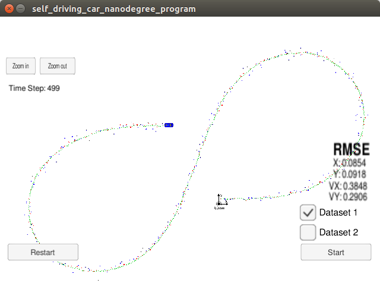
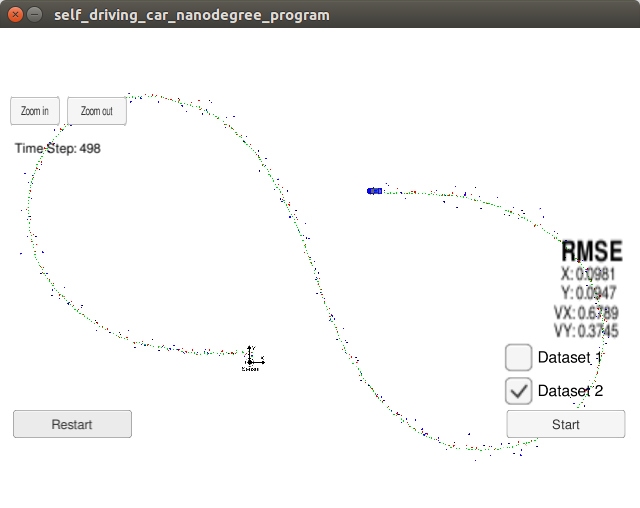

# Unscented Kalman Filter Project

This project utilizes an Unscented Kalman Filter to estimate the state of a moving bicycle 
with noisy lidar and radar measurements. 
The project is based on udacity's starter code for project unscented kalman filter
in the self-driving car engineer nanodegree program.

# Project files
The following source files are (mainly) contained in this project:
* main.cpp: receives sensor measurements from the simulator in a loop and uses FusioneEKF
* ukf.cpp: processes the sensor measurements and implements the unscented kalman filter 
using new measurements from lidar and radar. Holds the current state vector and covariance matrix.
* tools.cpp: implements RMSE calculation.
* Eigen/*: the Eigen library for handling vectors and matrices

# Project results
On the given datasets in udacity simulator (with version 1.45 of 15.6.2017) the following results 
for root mean squared error (RMSE) were achieved:
* dataset 1: rmse=(px=0.0854,py=0.0918,vx=0.3848,vy=0.2906)

* dataset 2: rmse=(px=0.0981,py=0.0947,vx=0.6789,vy=0.3745)
 

# Simulator Setup (Prerequisites) 
This project involves the Term 2 Simulator which can be downloaded [here](https://github.com/udacity/self-driving-car-sim/releases)
This repository includes two files that can be used to set up and install [uWebSocketIO](https://github.com/uWebSockets/uWebSockets) for either Linux or Mac systems. For windows you can use either Docker, VMware, or even [Windows 10 Bash on Ubuntu](https://www.howtogeek.com/249966/how-to-install-and-use-the-linux-bash-shell-on-windows-10/) to install uWebSocketIO. Please see [this concept in the classroom](https://classroom.udacity.com/nanodegrees/nd013/parts/40f38239-66b6-46ec-ae68-03afd8a601c8/modules/0949fca6-b379-42af-a919-ee50aa304e6a/lessons/f758c44c-5e40-4e01-93b5-1a82aa4e044f/concepts/16cf4a78-4fc7-49e1-8621-3450ca938b77) for the required version and installation scripts.

Once the install for uWebSocketIO is complete, the main program can be built and ran by doing the following from the project top directory.
1. mkdir build
2. cd build
3. cmake ..
4. make
5. ./UnscentedKF

Tips for setting up your environment can be found [here](https://classroom.udacity.com/nanodegrees/nd013/parts/40f38239-66b6-46ec-ae68-03afd8a601c8/modules/0949fca6-b379-42af-a919-ee50aa304e6a/lessons/f758c44c-5e40-4e01-93b5-1a82aa4e044f/concepts/23d376c7-0195-4276-bdf0-e02f1f3c665d)

## Other Important Dependencies
* cmake >= 3.5
  * All OSes: [click here for installation instructions](https://cmake.org/install/)
* make >= 4.1 (Linux, Mac), 3.81 (Windows)
  * Linux: make is installed by default on most Linux distros
  * Mac: [install Xcode command line tools to get make](https://developer.apple.com/xcode/features/)
  * Windows: [Click here for installation instructions](http://gnuwin32.sourceforge.net/packages/make.htm)
* gcc/g++ >= 5.4
  * Linux: gcc / g++ is installed by default on most Linux distros
  * Mac: same deal as make - [install Xcode command line tools](https://developer.apple.com/xcode/features/)
  * Windows: recommend using [MinGW](http://www.mingw.org/)

# Basic Build Instructions

1. Clone this repo.
2. Make a build directory: `mkdir build && cd build`
3. Compile: `cmake .. && make`
4. Run it: `./UnscentedKF` Previous versions use i/o from text files.  The current state uses i/o
from the simulator.

